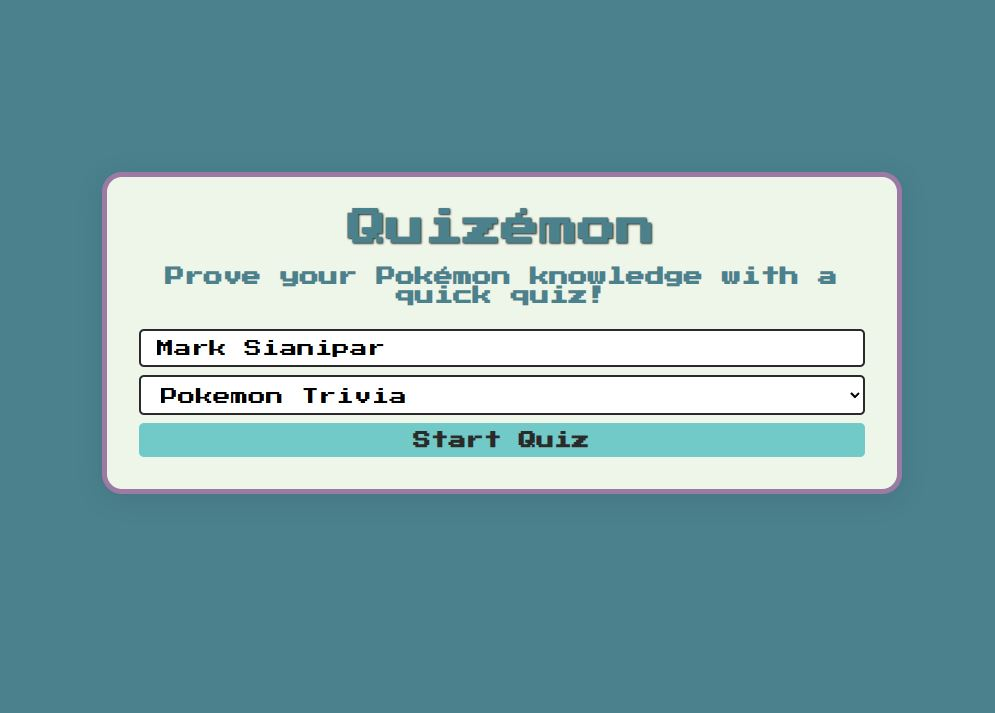
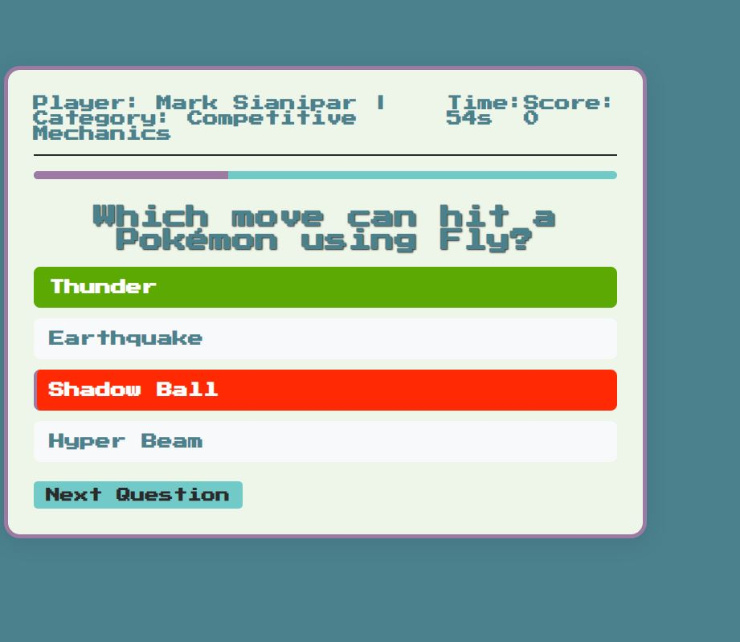
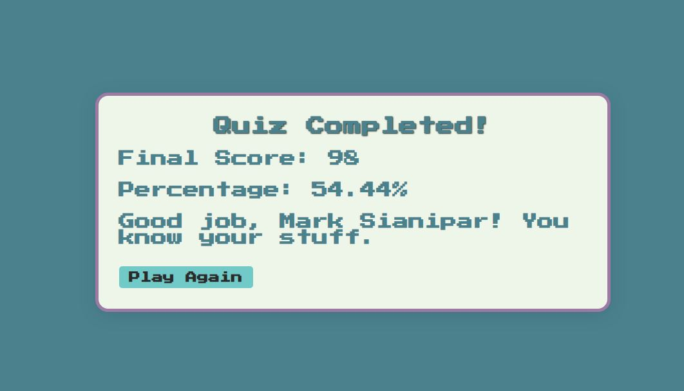

# Quizémon

## Description

Test your Pokémon knowledge among three trivia categories: Pokemon Trivia, Competitive Mechanics, and Pokemon History. Scoring is based on selecting the correct answer and the speed in which you submit it. There are three questions per category and a 1 minute timer. Getting 100% is pretty difficult, but give it a shot and try all the categories!

## Usage
Clone the repo and navigate to the index.html file. Open the file within the browser and attempt the quiz.

##Table of Contents
- [Description](#description)
- [Usage](#usage)
- [Credits](#credits)
- [License](#license)
- [Technology](#technology)
- [Reflection](#reflection)

## Welcome Page

## Quiz Page

## Result Page

## Credits

Mark Sianipar

## Technology

This assignment utilized Javascript, CSS, and HTML.

## Reflection
After completing this project, it became clear that managing multiple document.getElementById calls can quickly become hectic. Despite the project’s relatively simple components, the JavaScript file still contained 19 document.getElementById entries. Additionally, managing which screens were active or inactive proved challenging during debugging.

At one point, I successfully hid the welcomeScreen, but this inadvertently disabled all functionality on the webpage. While the function itself worked, the sheer number of class and ID references became overwhelming—many were either incorrectly referenced or misspelled. For example, I often added an unnecessary "s" to pluralize names (e.g., optionLists instead of optionList), which led to errors.

Moving forward, I need to plan the application’s "state" management more thoroughly, especially for a single-page application like this. When transitioning to React, I’ll be more mindful of which elements truly need classes or IDs and enforce stricter naming conventions to avoid similar issues.
